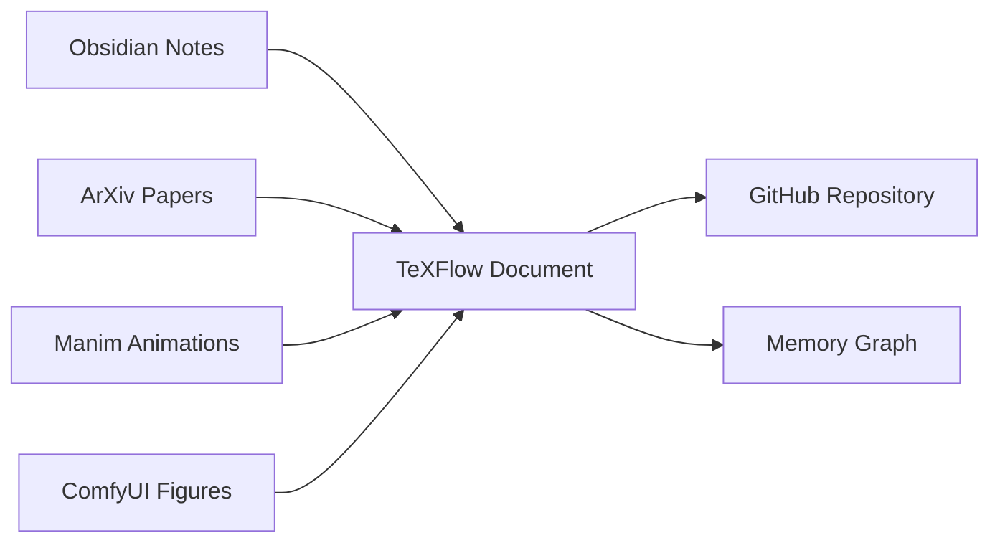
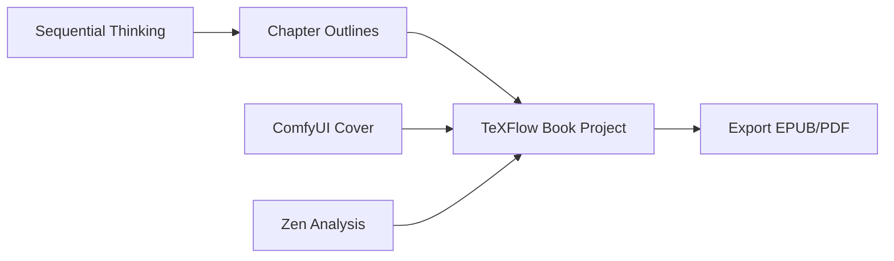
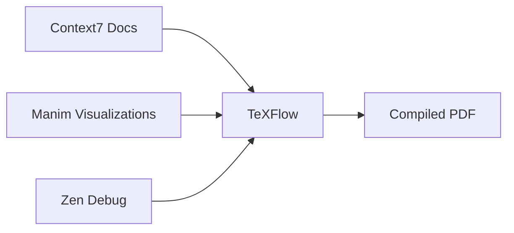

# TeXFlow MCP Synergies Analysis

## Overview

This document analyzes how TeXFlow can work synergistically with other installed MCP servers to create powerful academic and creative workflows.

## 🔥 High-Priority Synergies

### 1. TeXFlow + ArXiv LaTeX MCP 
**Connection**: ESSENTIAL - They're in the same repository!
**Use Case**: Academic research workflow

**Example Workflow**:
```python
# 1. Search for papers on quantum computing
arxiv_search("quantum computing algorithms")

# 2. Download paper and LaTeX source
arxiv_download("2301.00001", include_source=True)

# 3. Import into TeXFlow project
texflow.project(action="create", name="quantum-research")
texflow.document(action="create", path="references/arxiv_2301_00001.tex", content=arxiv_source)

# 4. Extract bibliography entry
texflow.bibliography(action="import", source="arXiv:2301.00001")

# 5. Cite in your paper
texflow.document(action="append", path="main.tex", 
                content="As shown in \\cite{arxiv_2301_00001}...")
```

### 2. TeXFlow + Manim Server
**Connection**: Create mathematical animations for papers
**Use Case**: Visualizing complex mathematical concepts

**Example Workflow**:
```python
# 1. Create animation for theorem visualization
manim_code = """
class TheoremVisualization(Scene):
    def construct(self):
        # Visualize convergence theorem
        ...
"""
manim.execute_manim_code(manim_code)

# 2. Include in LaTeX document
texflow.document(action="append", path="chapter3.tex", 
                content="""
\\begin{figure}[h]
    \\includegraphics{animations/theorem_viz.mp4}
    \\caption{Convergence of the algorithm}
\\end{figure}
""")
```

### 3. TeXFlow + ComfyUI
**Connection**: Generate figures and diagrams
**Use Case**: Creating visual abstracts, diagrams, book covers

**Example Workflow**:
```python
# 1. Generate a diagram for your paper
comfyui.generate_image(
    prompt="Scientific diagram showing neural network architecture, clean, professional",
    width=1920, height=1080
)

# 2. Add to LaTeX document
texflow.document(action="append", path="methodology.tex",
                content="""
\\begin{figure}[htbp]
    \\centering
    \\includegraphics[width=0.8\\textwidth]{figures/neural_architecture.png}
    \\caption{Proposed neural network architecture}
\\end{figure}
""")

# 3. Generate book cover
comfyui.generate_image(
    prompt="Abstract mathematical book cover, topology, elegant",
    width=1600, height=2400
)
```

### 4. TeXFlow + Obsidian
**Connection**: Research note management
**Use Case**: Convert research notes to papers

**Example Workflow**:
```python
# 1. Get research notes from Obsidian
notes = obsidian.search_nodes("quantum computing research")

# 2. Convert to LaTeX sections
for note in notes:
    content = obsidian.get_file_contents(note.path)
    # Convert Markdown to LaTeX
    latex_content = texflow.document(
        action="create",
        path=f"notes/{note.name}.tex",
        content=content,
        format="markdown"  # Auto-converts
    )

# 3. Build paper outline from notes
texflow.document(action="create", path="outline.tex",
                content="\\section{Introduction}\n\\input{notes/intro}\n...")
```

### 5. TeXFlow + GitHub
**Connection**: Version control and collaboration
**Use Case**: Managing paper revisions and submissions

**Example Workflow**:
```python
# 1. Create repository for paper
github.create_repository(name="quantum-paper-2024", private=True)

# 2. Push TeXFlow project
texflow.version(action="commit", path=".", message="Initial draft")
github.push_files(
    owner="username",
    repo="quantum-paper-2024",
    branch="main",
    files=[{"path": "main.tex", "content": texflow_content}],
    message="Add initial paper draft"
)

# 3. Create PR for reviewer comments
github.create_pull_request(
    title="Address reviewer comments",
    head="revisions",
    base="main",
    body="Addresses all reviewer concerns..."
)
```

## 🎯 Valuable Synergies

### 6. TeXFlow + Memory (Knowledge Graph)
**Connection**: Track research concepts and citations
**Use Case**: Building a personal research knowledge base

**Example Workflow**:
```python
# 1. Extract key concepts from paper
concepts = texflow.smart_edit(action="search", 
                             pattern="\\\\textbf{([^}]+)}", 
                             scope="all")

# 2. Add to knowledge graph
for concept in concepts:
    memory.create_entities([{
        "name": concept,
        "entityType": "ResearchConcept",
        "observations": [f"Defined in {paper_name}"]
    }])

# 3. Track citations
memory.create_relations([{
    "from": "MyPaper2024",
    "to": "Smith2023",
    "relationType": "cites"
}])
```

### 7. TeXFlow + Zen (AI Analysis)
**Connection**: Advanced LaTeX assistance
**Use Case**: Complex debugging and optimization

**Example Workflow**:
```python
# 1. Debug complex LaTeX error
error_log = texflow.compile(path="thesis.tex")
zen.debug(
    step="Analyze LaTeX compilation error",
    findings=error_log,
    files_checked=["thesis.tex", "preamble.tex"]
)

# 2. Optimize document structure
zen.analyze(
    step="Review thesis structure for clarity",
    relevant_files=["thesis.tex", "chapters/*.tex"],
    analysis_type="architecture"
)
```

### 8. TeXFlow + Context7
**Connection**: LaTeX package documentation
**Use Case**: Learning new packages and commands

**Example Workflow**:
```python
# 1. Get TikZ documentation for diagram
tikz_docs = context7.get_library_docs(
    library="pgf/tikz",
    topic="graphs"
)

# 2. Apply to document
texflow.document(action="append", path="diagrams.tex",
                content=tikz_example_from_docs)
```

### 9. TeXFlow + DDG Search
**Connection**: Research and reference finding
**Use Case**: Finding citations and LaTeX solutions

**Example Workflow**:
```python
# 1. Search for recent papers
results = ddg_search.search("quantum computing 2024 site:arxiv.org")

# 2. Search for LaTeX solutions
latex_help = ddg_search.search("latex tikz commutative diagram")
```

### 10. TeXFlow + Claude Code
**Connection**: Code snippets for papers
**Use Case**: Including and formatting code examples

**Example Workflow**:
```python
# 1. Format algorithm for paper
claude_code("Format this Python algorithm as LaTeX algorithmic pseudocode")

# 2. Create code listings
claude_code("Convert this implementation to LaTeX listings format with syntax highlighting")
```

## 📊 Specialized Workflows

### Academic Paper Pipeline


### Book Writing Pipeline


### Mathematical Documentation


## 🚀 Power User Combinations

### 1. Full Academic Workflow
**TeXFlow + ArXiv + Obsidian + GitHub + Memory**
- Research in Obsidian
- Import papers from ArXiv
- Write in TeXFlow
- Version control with GitHub
- Track knowledge in Memory

### 2. Visual Mathematics
**TeXFlow + Manim + ComfyUI + Context7**
- Write equations in TeXFlow
- Animate with Manim
- Create diagrams with ComfyUI
- Reference docs from Context7

### 3. AI-Assisted Writing
**TeXFlow + Zen + Gemini + DDG Search**
- Write with TeXFlow
- Debug with Zen
- Get suggestions from Gemini
- Research with DDG

## 🔧 Implementation Examples

### Setup Research Project
```python
# 1. Create project structure
texflow.project(action="create", name="ml-research", template="thesis")

# 2. Import recent papers
for arxiv_id in ["2401.00001", "2401.00002"]:
    paper = arxiv.download(arxiv_id)
    texflow.bibliography(action="import", source=f"arXiv:{arxiv_id}")

# 3. Setup knowledge graph
memory.create_entities([
    {"name": "ML Research Project", "entityType": "Project"},
    {"name": "Neural Networks", "entityType": "Topic"}
])

# 4. Create GitHub repo
github.create_repository(name="ml-research-2024")
```

### Generate Paper Figures
```python
# 1. Create data visualization with Manim
manim_code = create_data_viz_code()
manim.execute_manim_code(manim_code)

# 2. Generate architecture diagram
comfyui.generate_image(
    prompt="Neural network architecture diagram, scientific style",
    model="SDXL"
)

# 3. Add to paper
texflow.document(action="append", path="results.tex", 
                content=include_figures_latex())
```

## 🎓 Best Practices

1. **Start with TeXFlow**: Create your project structure first
2. **Import Early**: Get references from ArXiv before writing
3. **Track Everything**: Use Memory for concept tracking
4. **Version Often**: Commit to GitHub before major changes
5. **Visualize Complex Ideas**: Use Manim for math, ComfyUI for diagrams
6. **Debug with AI**: Use Zen for complex LaTeX issues
7. **Document Sources**: Link Obsidian notes to LaTeX sections

## 🚫 Limited Synergies

These MCPs have limited direct interaction with TeXFlow:
- **Playwright**: Could scrape journal websites for formatting requirements
- **Model Jump/TaskFork**: Internal AI infrastructure, not content-focused
- **Sequential Thinking**: Better for planning than document creation

## 💡 Future Integration Ideas

1. **Auto-Bibliography**: ArXiv → TeXFlow bibliography automation
2. **Note-to-Paper**: Obsidian → TeXFlow with AI formatting
3. **Visual Abstract Generator**: TeXFlow + ComfyUI + Manim pipeline
4. **Collaborative Reviews**: TeXFlow + GitHub PR reviews
5. **Knowledge-Aware Writing**: Memory suggests relevant citations

## Conclusion

TeXFlow becomes exponentially more powerful when combined with other MCP servers. The key synergies are:
- **ArXiv**: Paper import and bibliography
- **Manim**: Mathematical visualizations
- **ComfyUI**: Figures and diagrams
- **Obsidian**: Research note integration
- **GitHub**: Version control and collaboration
- **Memory**: Knowledge tracking
- **Zen**: AI-powered assistance

Together, these create a comprehensive academic and creative writing environment that covers the entire workflow from research to publication.